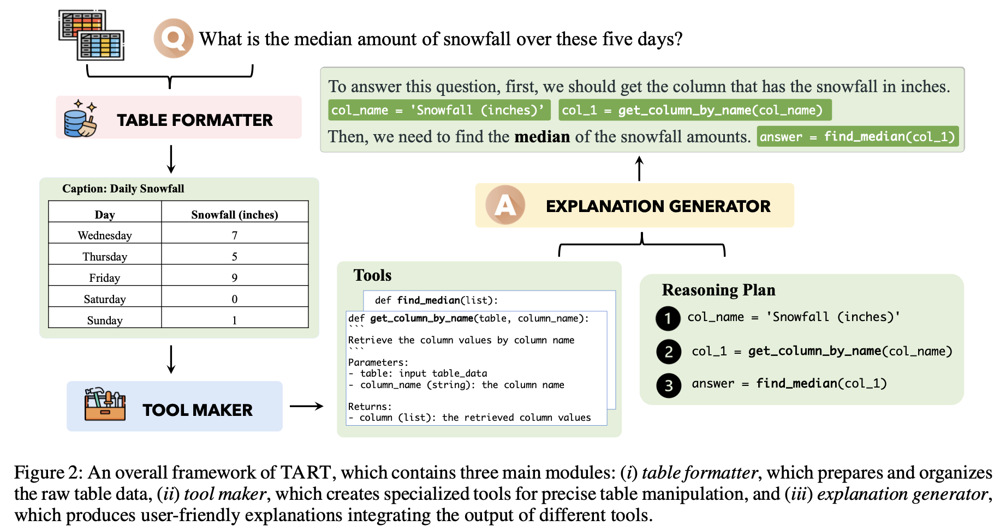

# TART: Tool-Augmented Reasoning for Tables

Source code for the paper ["TART: An Open-Source Tool-Augmented Framework for Explainable Table-based Reasoning"](http://arxiv.org/abs/2409.11724).

## Introduction

TART (Tool-Augmented Reasoning for Tables) enhances the capabilities of Large Language Models (LLMs) by integrating them with specialized computational tools. This approach improves both the precision of data processing and the clarity of the reasoning process. The framework is particularly suited for tasks that require high levels of accuracy and explainability, such as in fields like finance, science, and healthcare. 



## Project Structure

The project includes several key components each responsible for a stage in the data processing and reasoning pipeline:

- `tool_discovery/`: Generate tool data for the following steps.
- `table_formatter/`: Prepares and formats table data for processing.
- `tool_maker/`: Develops specific computational tools for table manipulation.
- `explanation_generator/`: Provides clear and understandable explanations of the reasoning outputs.
- Other directories include scripts for training LLMs (`llama_training`), executing reasoning (`reasoning_executor`), and utility functions (`table_utils.py`).

### 1. table_formatter

This module processes raw table data to generate training data, train models, and perform inference:

- `data_processing.py`: Generates formatted training data for table formater module.
- `train.sh`: Trains the table formatter model using the specified LLM backbone.
- `inference.sh`: Runs the inference process to format new table data.
- `model_save/`: Stores the trained model artifacts.
- `output/`: Holds the output from the inference processes.

### 2. tool_maker

Similar to `table_formatter`, this module focuses on generating and training tools for table manipulation:

- `data_processing.py`: Prepares training data for tool generatio modulen.
- `dataset_inference_tart.py`: Performs inference to test the tools on new data.
- `train.sh`: Script to train the tool maker model.
- `inference_tart.sh`: Executes tool inference and generates output.
- `model_save/`: Directory for saving model checkpoints.
- `output/`: Directory for saving inference outputs.

### 3. explanation_generator

Responsible for generating explanations based on the outputs from the tool maker and table formatter:

- `data_generation/`: Scripts and utilities for generating explanatory data.
- `data_processing.py`: Processes data for training the explanation generation models.
- `train.sh`: Trains the explanation generator model.
- `inference.sh`: Runs the inference to generate explanations from processed data.
- `model_save/`: Stores the trained explanation models.
- `output/`: Contains generated explanations for review or further processing.


## Setup and Installation

To set up the environment and install necessary dependencies, run:

```bash
pip install -r requirements.txt
```

## Usage

### Generating Tool Data: 
Navigate to the `tool_discovery` directory and execute the following command:

```bash
bash run.sh
```
This will start the process of generating tool data which is used by other components of the framework.

### Training Models
To train the Llama models used in TART, navigate to the `llama_training` directory

### Executing Reasoning
After training, to execute the reasoning process using the trained models and generated tools, run:

```bash
python execute_reasoning.py
```

## Data Sample
Example of each sample with tool discovery: 

```json
  {
    "id": "316478c4-0211-4bab-bb48-c12e4e412eef",
    "question": "Is it true that Planned parenthood has a history of clergy alliances?",
    "gold": "yes",
    "prediction": "table_data = [[None, None],[\"Title\", \"Sacred Work: Planned Parenthood and Its Clergy Alliances\"],[\"Author\", \"Tom Davis\"],[\"Edition\", \"illustrated\"],[\"Publisher\", \"Rutgers University Press, 2005\"],[\"ISBN\", \"0813534933, 9780813534930\"],[\"Length\", \"245 pages\"],[\"Subjects\", \"Social Science Sociology of ReligionSocial Science / Sociology of Religion\"],[\"Export Citation\", \"BiBTeX EndNote RefMan\"]]\n\n# Get the row by name\ndef get_row_by_name(table, key):\n    for row in table:\n        if row[0] is not None and row[0].lower() == key.lower():\n            return row[1]\n    return None\n\ndef solution(table_data):\n    title = get_row_by_name(table_data, \"Title\")\n    subjects = get_row_by_name(table_data, \"Subjects\")\n    answer = True\n    if \"clergy alliances\" in title.lower() or \"clergy\" in subjects.lower():\n            return answer\n    answer = False\n    return answer\n\nprint(solution(table_data))"
  }
```


## Reference
Please cite the paper in the following format if you use this code during your research.

```
@article{lu2024tartopensourcetoolaugmentedframework,
  author       = {Xinyuan Lu and Liangming Pan and Yubo Ma and Preslav Nakov and Min-Yen Kan},
  title        = {TART: An Open-Source Tool-Augmented Framework for Explainable Table-based Reasoning},
  journal      = {CoRR},
  volume       = {abs/2409.11724},
  year         = {2024},
  url          = {https://doi.org/10.48550/arXiv.2409.11724}
}
```

## Q&A
If you encounter any problem, please either directly contact the [Xinyuan Lu](luxinyuan@u.nus.edu) or leave an issue in the github repo.